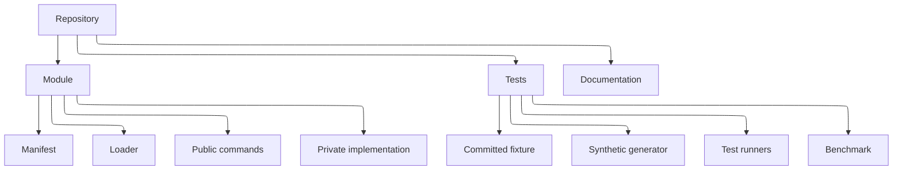
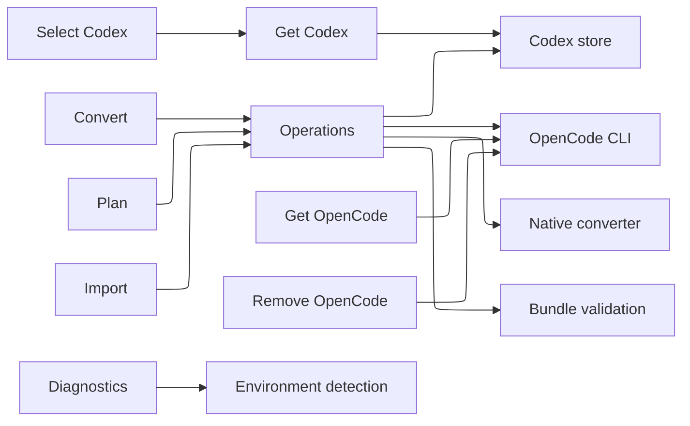
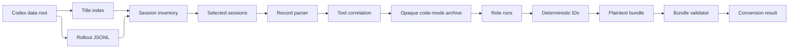

# Architecture

`OpenCode.ImportCodex` is a script module with eight public commands. Public
files define the user contract; private files own discovery, conversion,
validation, CLI integration, and orchestration. Importing the module only loads
function definitions and does not scan sessions, invoke applications, or create
files.

## Repository Tree

The repository contains the following maintained paths:

```text
.
|-- .gitattributes
|-- .gitignore
|-- .vscode/
|   `-- settings.json
|-- docs/
|   |-- Architecture.md
|   |-- Commands.md
|   |-- Conversion.md
|   `-- Testing.md
|-- src/
|   `-- OpenCode.ImportCodex/
|       |-- OpenCode.ImportCodex.psd1
|       |-- OpenCode.ImportCodex.psm1
|       |-- Private/
|       |   |-- CodexStore.ps1
|       |   |-- CodexTypedItems.ps1
|       |   |-- Common.ps1
|       |   |-- NativeConverter.ps1
|       |   |-- OpenCodeBundle.ps1
|       |   |-- OpenCodeCli.ps1
|       |   `-- Operations.ps1
|       `-- Public/
|           |-- Convert-CodexSession.ps1
|           |-- Get-CodexSession.ps1
|           |-- Get-CodexSessionImportPlan.ps1
|           |-- Get-OpenCodeSession.ps1
|           |-- Import-CodexSession.ps1
|           |-- Remove-OpenCodeSession.ps1
|           |-- Select-CodexSession.ps1
|           `-- Test-CodexOpenCodeEnvironment.ps1
|-- tests/
|   |-- .gitignore
|   |-- Invoke-AllTests.ps1
|   |-- README.md
|   |-- Benchmarks/
|   |   `-- Measure-CodexSessionConversion.ps1
|   |-- Contract/
|   |   `-- Test-ModuleContract.ps1
|   |-- Documentation/
|   |   `-- Test-Documentation.ps1
|   |-- Fixtures/
|   |   `-- ComplexLegacy/
|   |       `-- Codex/
|   |           |-- session_index.jsonl
|   |           `-- sessions/2026/01/01/
|   |               `-- rollout-2026-01-01T00-00-00-11111111-2222-3333-4444-555555555555.jsonl
|   |-- Integration/
|   |   `-- Test-SyntheticConversion.ps1
|   |-- Publication/
|   |   `-- Test-Publication.ps1
|   |-- Support/
|   |   `-- New-SyntheticCodexData.ps1
|   `-- Unit/
|       |-- Test-CodexCustomToolOutput.ps1
|       `-- Test-OpenCodeBundleValidation.ps1
|-- CONTRIBUTING.md
|-- LICENSE
|-- README.md
`-- SECURITY.md
```



## Public Boundary

The manifest and loader export exactly these commands:

```text
Get-CodexSession
Select-CodexSession
Convert-CodexSession
Get-CodexSessionImportPlan
Import-CodexSession
Get-OpenCodeSession
Remove-OpenCodeSession
Test-CodexOpenCodeEnvironment
```

No private function, converter entry point, variable, alias, or cmdlet is
exported. Public commands contain parameter declarations and comment-based help,
then delegate to private functions. This keeps implementation details out of the
PowerShell command contract.



## Module File Responsibilities

| File | Responsibility |
| --- | --- |
| `OpenCode.ImportCodex.psd1` | Declares module identity, PowerShell 5.1 minimum, Desktop/Core compatibility, and the exact export list. |
| `OpenCode.ImportCodex.psm1` | Enables strict mode, dot-sources private files first and public files second in an explicit order, then exports the eight public functions. |
| `Public/Get-CodexSession.ps1` | Returns normalized Codex inventory and resolves exact IDs, unique prefixes, or Codex deeplinks. |
| `Public/Select-CodexSession.ps1` | Displays the only interactive picker and returns selected Codex session objects. |
| `Public/Convert-CodexSession.ps1` | Defines pipeline, ID, and all-session conversion parameter sets and writes validated bundles. |
| `Public/Get-CodexSessionImportPlan.ps1` | Converts bundles and compares deterministic IDs with current OpenCode data without importing. |
| `Public/Import-CodexSession.ps1` | Applies high-impact `ShouldProcess` gating, converts, imports, and verifies sessions. |
| `Public/Get-OpenCodeSession.ps1` | Queries and normalizes OpenCode root-session inventory. |
| `Public/Remove-OpenCodeSession.ps1` | Resolves targets, applies all-session and `ShouldProcess` confirmations, deletes through the CLI, and verifies removal. |
| `Public/Test-CodexOpenCodeEnvironment.ps1` | Returns best-effort platform, CLI, desktop candidate, and Codex store diagnostics. |
| `Private/Common.ps1` | Validates IDs, normalizes and compares paths, chooses the output root, detects applications, and checks external process exit codes. |
| `Private/CodexStore.ps1` | Resolves the Codex root, reads shared rollout metadata and the title index, builds inventory, resolves references, and validates pipeline objects. |
| `Private/CodexTypedItems.ps1` | Converts authoritative paginated `item_completed` records for command, file-change, MCP, web, image-view, dynamic, plan, and extension items. |
| `Private/NativeConverter.ps1` | Reads JSONL history, maps records to OpenCode messages and parts, derives deterministic IDs, and atomically writes plaintext JSON bundles. |
| `Private/OpenCodeBundle.ps1` | Validates bundle identity, roles, parts, relationships, images, tool states, and target directory; compares generated IDs with an existing export for planning. |
| `Private/OpenCodeCli.ps1` | Uses supported OpenCode CLI commands for global root-session inventory, export, import, verification, and deletion. |
| `Private/Operations.ps1` | Composes selection, target resolution, output naming, conversion, planning, and import result objects. |

## Conversion Data Flow

Inventory reads the first `session_meta` line from each rollout and optional
titles from `session_index.jsonl`. Conversion reopens only selected rollout files,
streams importable JSONL rows, correlates tool calls and results, groups adjacent
records by user or assistant side, archives surviving opaque code-mode executions
as synthetic user text metadata, and emits one validated OpenCode JSON bundle per
Codex session. Exact opaque source and output remain in metadata; only a bounded,
count-only disclosure is projected to a resumed model.



Output files are named from validated source IDs. Writes use a temporary file in
the output directory and replace an existing bundle with backup recovery logic.
Validation runs after every conversion.

## Import Flow

Planning and import require an installed OpenCode CLI. Global root-session
inventory uses a read-only `opencode db` query. Planning exports a matching
deterministic session when present and compares message and part IDs plus
canonical content for matching IDs. It rejects an ID already associated with
another directory, writes a bundle, and does not import.

Import resolves an existing target directory, rejects a deterministic ID already
associated with another directory, calls `ShouldProcess` before conversion,
writes and validates the bundle, changes the process location to the target
directory, runs `opencode import <bundle> --pure`, and verifies both the session
ID and directory from project-scoped `opencode session list -n 10000 --format
json --pure`. Location is restored in a `finally` block. OpenCode database files
are never edited directly.

Removal similarly uses `opencode session delete` and then refreshes inventory to
verify that deleted IDs are absent.

## Module Load Flow

1. PowerShell reads `OpenCode.ImportCodex.psd1` and loads its root module.
2. `OpenCode.ImportCodex.psm1` enables strict mode.
3. Seven private files are dot-sourced in dependency order.
4. Eight public files are dot-sourced.
5. `Export-ModuleMember` publishes the same eight functions declared by the
   manifest.

Loading has no external side effects beyond defining functions in module scope.
The module contract test snapshots repository entries before and after import to
enforce that property.

## Portability And Dependencies

The manifest supports Windows PowerShell 5.1 and PowerShell Core. Paths are built
with .NET and `Join-Path`, comparisons are case-insensitive on Windows and
case-sensitive elsewhere, and timestamps use `DateTimeOffset`. The converter
uses built-in JSON, cryptography, file, and collection APIs only.

There are no module, package-manager, runtime, or network dependencies for
conversion. OpenCode-dependent commands discover an existing `opencode`
application and fail with a direct requirement message when it is unavailable.
Desktop detection is informational and platform-specific; conversion does not
depend on a desktop application.
