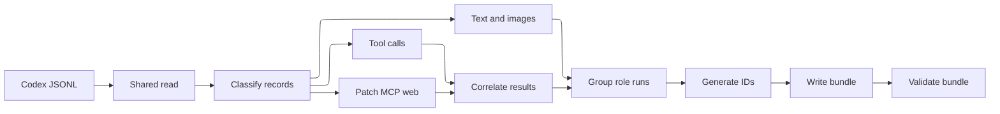

# Conversion Fidelity

The module converts selected Codex rollout JSONL files into OpenCode import JSON.
Conversion is implemented by private PowerShell code, requires no OpenCode
installation, and never executes historical session content.

## Mapping Summary

| Codex content | OpenCode representation | Fidelity notes |
| --- | --- | --- |
| User text | User message with `text` part | Nonblank `input_text`, `output_text`, and `text` content is preserved as text. |
| Assistant text | Assistant message with `text` part | Nonblank text is preserved. Consecutive records on the same side share a message. |
| Function or custom tool call | Assistant `tool` part | Structured arguments are retained; JSON strings are parsed when possible. |
| Function or custom tool output | Tool state output or error | Text-only custom envelopes are flattened exactly for readability; malformed, unknown, or mixed envelopes stay raw. Non-string output is serialized as compressed JSON. Missing output becomes an error result. |
| Embedded image | `file` part | Base64 `data:image/...` input is preserved with MIME type and a generated file name. |
| Unsupported image reference | Text omission marker | External or unsupported image references are not fetched. |
| Patch completion | Structured `apply_patch` tool part | Changed paths, add/delete content, unified diffs, move paths, status, and output are retained when present. |
| MCP completion | Structured `mcp__server__tool` tool part | Arguments, text output, error state, and original result envelope metadata are retained. MCP image content becomes a textual MIME marker. |
| Web completion | `websearch` or `webfetch` tool part | Query, URL, pattern, persisted results, action, and metadata are retained when available. No request is repeated. |
| Paginated typed item | Native tool when supported; otherwise `codex_plan` or `codex_item` | Exact `item_completed` data is retained. Commands, file changes, MCP, web, image-view, and dynamic tools receive specialized mappings. |
| Codex code mode | Synthetic context text on the originating user turn | The UI-hidden text discloses only the opaque execution count. Exact JavaScript and persisted outer output are retained in part metadata, excluded from model context, and never evaluated. |
| Codex compaction checkpoint | OpenCode `compaction` part and completed summary message | The latest checkpoint excludes older archive records from resumed model context. The last readable assistant response is bounded and retained; encrypted provider state cannot be transferred. |
| Token count | Assistant token metadata | Last-request input, output, reasoning, cache, and total usage are mapped to OpenCode fields. |
| Reasoning item | Omitted | Private reasoning is not imported. |
| Developer message | Omitted | Developer instructions are not imported as conversation turns. |

## Text And Message Grouping

User records and user images are assigned to the user side. Assistant text and
all tool calls are assigned to the assistant side. Adjacent records on one side
are grouped into one OpenCode message; a side change starts a new message. This
preserves order but does not promise a one-to-one mapping between Codex JSONL
rows and OpenCode messages.

Each user message receives the `build` agent and the fixed import model metadata.
Each assistant message receives a zero-cost historical record using provider
`openai`, model `gpt-5.1`, mode `build`, and the selected target path. Persisted
Codex last-request usage is retained when present; otherwise token fields are
zero. The fixed provider and model fields make a portable historical bundle and
are not a claim that the original response used that model.

Blank text is skipped. Malformed JSONL rows are skipped. Conversion fails if no
importable records remain.

## Tools

Known names are normalized for OpenCode display:

| Codex name | OpenCode name |
| --- | --- |
| `Bash`, `shell`, `exec_command`, `local_shell` | `bash` |
| `Edit` | `edit` |
| `apply_patch` | `apply_patch` |
| `Write` | `write` |
| `Read`, `read_file`, `view_image` | `read` |

Other names are lowercased. Historical tools are represented as completed or
errored cards and are never executed. If a call has no persisted result, the
converter creates an error state with the message that the call ended before a
result was recorded.

For duplicate call records with the same call ID, the higher-authority persisted
completion event wins over a generic response item. Duplicate completion events
with the same event type and call ID, and duplicate typed items with the same
item ID, are ignored. An opaque outer execution is also suppressed when an
authoritative typed or legacy completion occurs after that call and before its
matching outer output. Turn membership alone is never treated as proof that an
opaque outer execution represents a typed or legacy completion.

Legacy histories use patch, MCP, and web completion events. Paginated histories
use `item_completed` records. Their command argument arrays are rendered with
Codex-compatible shell quoting while the original array remains in metadata.
File changes are ordinal path-sorted like Codex app-server output; the exact persisted
change object is also included in tool input so it remains available to a
resumed model. Plans receive `codex_plan`; unsupported typed variants receive a
generic `codex_item` instead of being discarded.

Core rollout command working directories and image-view paths use `file:`
`PathUri` strings. Local POSIX, Windows-drive, and UNC forms are decoded for
OpenCode tool input while the original URI remains in Codex metadata. Dynamic
tool text is emitted directly; persisted image and audio URLs receive explicit
model-visible media markers.

## Images

Only inline `data:` references whose MIME type begins with `image/` become native
OpenCode file parts. The original data URL is retained in plaintext in the
bundle. File names use an ordinal and a MIME-derived extension, such as
`codex-image-1.png`. JPEG and SVG receive `jpg` and `svg` extensions.

The module performs no image download. A non-inline reference becomes a text
marker stating that the unsupported Codex image reference was omitted. MCP image
results are represented by a textual MIME marker because the persisted MCP
envelope does not provide the same native input-image mapping.

## Patch, MCP, And Web Events

Patch completion events become `apply_patch` cards. Metadata can include each
file's relative and original path, operation type, before/after content for
adds/deletes, unified diff for updates, and move path. Standard output and error
text are joined; when both are absent, a generated applied-file count is used.

MCP names are formed as `mcp__<server>__<tool>` with unsupported name characters
replaced by underscores. Text and structured content are joined as model-visible
output. Persisted errors and the MCP `isError` flag create an error tool state.
The complete persisted result envelope remains under Codex metadata.

Web search actions map `open_page` and `find_in_page` to `webfetch`; other actions
map to `websearch`. The converter retains persisted query, URL, pattern, results,
and action metadata. If no results were persisted, output explicitly says so.
No network operation is performed.

## Code Mode

A custom `exec` call containing Codex code-mode JavaScript is archived without
creating an OpenCode tool part. Contiguous executions from the same Codex turn
still form one correlation group. Each surviving group becomes a `text` part on
the user message that originated the following assistant work. The part is
marked `synthetic`, which OpenCode intentionally omits from the displayed user
message while retaining its text for model continuation.

The synthetic text is a short, mechanically generated note. It reports only the
number of opaque executions and explicitly says that raw data is outside model
context. `metadata.codex.executions` stores every original outer call ID, exact
JavaScript source, and exact persisted outer output envelope. Readable decoding
used for ordinary tool-state display does not replace this archival copy.
OpenCode preserves user
text-part metadata in export but does not project that metadata to the model.
This avoids hundreds of synthetic tool cards and avoids promoting untrusted
historical command output to user-level instructions. The tradeoff is explicit:
raw opaque shell, plan, and permission history remains exportable archive data,
but only its occurrence count is available to a resumed model. Normal assistant
messages and authoritative native tool completions remain model-visible.

Moving the note to the originating user message consolidates it before the
following assistant response in model projection. Exact call ordering and turn
identity remain in metadata. The converter does not evaluate JavaScript or
infer arbitrary nested calls. An opaque outer execution is suppressed when a
higher-authority record has the same call ID or when an authoritative completion
is structurally bracketed between that outer call and its matching output. A
shared turn ID alone is not sufficient evidence.

## Compaction And Continuation

Codex remote compaction persists an encrypted provider-specific item rather than
a portable text summary. OpenCode cannot submit that encrypted Codex item through
its message schema. The converter therefore adds one OpenCode compaction marker
and completed summary for the latest Codex checkpoint. The summary explicitly
states this limitation and includes only the last readable assistant response
before the checkpoint, bounded to 12,000 characters. It does not duplicate
retained developer/user history or embedded image data.

The complete pre-checkpoint transcript remains in the imported session for UI
and archival use. OpenCode's compaction filter excludes it from subsequent model
requests, then includes the imported checkpoint and all later turns. Older Codex
checkpoints are omitted because the latest replacement history supersedes them.
This is necessarily lossy: prior assistant state represented only by encrypted
Codex data cannot be reconstructed outside Codex.

## Deterministic Identity

IDs are deterministic and satisfy OpenCode's accepted identifier schema:

- Session ID: hash of the source Codex session ID, prefixed with `ses_`.
- Message ID: a 14-hex-digit chronological prefix plus 12 hash-derived digits,
  prefixed with `msg_`.
- Part ID: the same 14-plus-12 format, prefixed with `prt_`, and ordered within
  its message.
- Tool call ID: hash of the persisted Codex call ID, prefixed with `call_`.
- Project ID: full SHA-1 hash of the normalized target directory string.

OpenCode currently generates a different 12-hex-plus-14-base62 layout. Imported
message and part IDs retain this module's established 14-plus-12 layout because
OpenCode pagination orders by stored creation time and ID, and changing the
deterministic formula would make prior imports appear as new messages on re-import.

The same source ID, target content ordering, and target directory produce the
same identities. The target directory affects the project ID and embedded path,
but not session, message, part, or call IDs.

## Append And Re-import

Repeated conversion to the same output path atomically replaces the prior bundle
and preserves deterministic IDs. Planning compares generated IDs to an existing
OpenCode export:

- No matching session produces `Action = 'Create'`.
- A matching session with unchanged content produces `Action = 'Append/no-op'`.
- Generated message and part IDs not present in OpenCode are counted as new.
- Existing OpenCode message IDs not present in the generated bundle are counted
  as OpenCode-only and are not removed by the module.
- Matching IDs with different canonical message metadata or part content produce
  `Action = 'Conflict'` and nonzero changed counts.
- A matching deterministic session associated with another directory is rejected
  before import so relocation cannot silently reassociate a prior import.

Representation migrations retain the affected source part IDs. An existing
session therefore plans as a content conflict instead of appending a second
representation beside stale parts. Because the official importer does not
overwrite matching IDs, applying such a migration requires an explicitly
approved delete and reimport after checking for OpenCode-only continuation.

OpenCode's importer decides how conflicts are stored. Deterministic IDs are
designed so append-only Codex history can add later messages without assigning
new identities to earlier positions. Re-import is not synchronization: edits to
historical content under an existing ID may not replace OpenCode content, and
OpenCode-only continuation turns are not folded back into Codex. Use
`Get-CodexSessionImportPlan` before re-importing diverged histories.

## Source Read-only Guarantee

The module reads `session_index.jsonl` and rollout files only. Rollouts are opened
with `FileAccess.Read` and shared read/write/delete access so an active producer
does not have to close the file. The module never archives, renames, deletes, or
writes Codex source files or databases.

Reading can update filesystem access-time metadata where the operating system has
enabled it. The content, creation time, and last-write time are not intentionally
changed. Output is rejected when it is lexically equal to or under the Codex data
root. See [`../SECURITY.md`](../SECURITY.md) for the symbolic-link caveat.

## Target Working Directory

Every conversion needs an existing target directory:

- By default, the module uses the `cwd` stored in the selected Codex session.
- `-DestinationDirectory` relocates exactly one selected session.
- Relocation is rejected when more than one session is selected.
- The resolved target is embedded in session and assistant-message path data.
- Import temporarily runs `opencode import` from that target directory, then
  restores the caller's location.
- Post-import verification requires OpenCode to report the same directory.

The module does not create a missing target project and does not copy project
files.

## Additional Limitations

- Codex-specific UI cards without a portable bundle equivalent are not recreated.
- Timestamps that cannot be parsed become Unix epoch zero; missing record times
  fall back to the session start when possible. Message creation times are made
  monotonic in source order so official OpenCode storage cannot reorder records
  whose rollout timestamps are missing or regress.
- The title falls back to `Relocated session` when no indexed title exists.
- Tool success from generic response output is assumed unless a higher-authority
  completion records an error.
- Rich event conversion depends on persisted event fields and history mode.
- A history whose first importable message is an assistant response is rejected
  because OpenCode assistant messages require a preceding parent message; the
  module does not fabricate a user turn or emit a cyclic parent reference.
- Bundle compatibility depends on the OpenCode import schema and may require
  module updates when OpenCode changes it.
- Planning and import require an installed and compatible OpenCode CLI.
