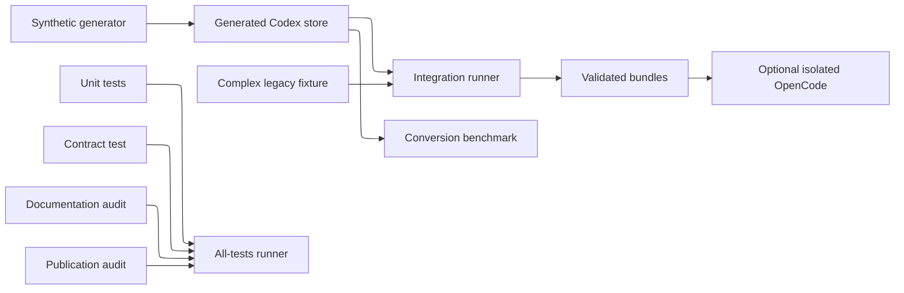

# Testing

The repository uses deterministic synthetic data only. Tests do not read the
current user's Codex store or normal OpenCode data home. Generated rollouts,
bundles, isolated OpenCode data, and benchmark reports stay below ignored
generated directories and are checked by the publication audit.

## Canonical Test Command

Run every repository test from the repository root:

```powershell
./tests/Invoke-AllTests.ps1 -Preset Tiny
```

This invokes publication, module-contract, unit, documentation, and integration
tests in a stable order and prints per-test timing. `Tiny`, `Small`, and `Medium`
select only the generated integration workload; the same correctness assertions
run for every preset.

When the OpenCode CLI is available, add the isolated official import/export
round trip:

```powershell
./tests/Invoke-AllTests.ps1 -Preset Tiny -TestOpenCodeImport
```

Generated integration data is removed by default. Retain it only for local
inspection:

```powershell
./tests/Invoke-AllTests.ps1 -Preset Medium -KeepGenerated
```

## Test Data Flow



## Test Layout And Naming

PowerShell project directories use PascalCase. External Codex store names such
as `sessions` and `session_index.jsonl` retain their source-defined spelling.
PowerShell test files use approved `Verb-Noun` names with PascalCase components.

| Path | Responsibility |
| --- | --- |
| `tests/Invoke-AllTests.ps1` | Canonical entry point for the complete suite. |
| `tests/Contract/Test-ModuleContract.ps1` | Syntax, manifest, API, help, naming, safety rejection, and side-effect-free load. |
| `tests/Documentation/Test-Documentation.ps1` | Markdown links, documented API/source inventory, current paths, naming, and safety disclosures. |
| `tests/Integration/Test-SyntheticConversion.ps1` | Public conversion pipeline, fidelity, deterministic ordering, planning, and optional official CLI round trip. |
| `tests/Publication/Test-Publication.ps1` | Private-data, generated-artifact, credential, path, ID, and legacy-layout audit. |
| `tests/Unit/Test-CodexCustomToolOutput.ps1` | Conservative custom-tool output-envelope decoding. |
| `tests/Unit/Test-OpenCodeBundleValidation.ps1` | Bundle counts and schema/relationship rejection behavior. |
| `tests/Support/New-SyntheticCodexData.ps1` | Seeded volume and shape generator. |
| `tests/Fixtures/ComplexLegacy/Codex/` | Small, committed, feature-rich legacy rollout fixture. |

## Module Contract

The contract test parses every repository PowerShell source, validates the
manifest, and verifies:

- Module import creates no repository files or directories.
- Exactly eight expected public functions are exported.
- Commands use approved verbs and singular nouns.
- Public parameters are PascalCase and do not expose implementation controls.
- Comment-based help includes all parameters, outputs, and at least two examples.
- `Import-CodexSession` explicitly supports `WhatIf` and `Confirm`.
- Malformed deeplinks, unsafe IDs, assistant-first histories, and output beneath
  the Codex root are rejected.
- `Import-CodexSession -WhatIf` creates no output when OpenCode is installed.
- The committed fixture hash is unchanged and the test leaves no artifacts.

## Unit Coverage

The custom-tool output unit test proves that arrays containing only
`input_text`, `output_text`, or `text` are concatenated exactly. Malformed JSON,
unknown variants, mixed text/image content, null items, missing text, and empty
arrays remain unchanged so conversion never silently drops content.

The bundle-validation unit test checks the exact `MessageCount` and `PartCount`
for a valid bundle containing normal text, synthetic archival text, and a tool.
It also proves rejection of duplicate part IDs, inconsistent parents,
nonterminal tool state, remote image URLs, target-directory mismatch, empty
messages, and invalid session IDs.

## Complex Legacy Fixture

The committed fixture is rooted at
`tests/Fixtures/ComplexLegacy/Codex/`. Its name reflects its purpose: it is
small on disk but intentionally dense in fidelity cases. Repeated conversion
must produce identical session, message, part, and call IDs. It exercises:

- User and assistant text plus one embedded image.
- Generic tool calls and outputs.
- Opaque code-mode grouping, structural bracket correlation, and conservative
  non-correlation for unrelated calls.
- UI-hidden synthetic notes on originating user messages, count-only model
  disclosure, and exact JavaScript/output in `metadata.codex.executions`.
- Structured patch events and duplicate suppression.
- MCP and web completions that remain authoritative native tools.
- Atomic output replacement and target directories containing spaces.

The integration runner also creates a paginated synthetic store using official
core wire shapes. It covers chronological IDs across the former 2026 wrap
boundary, monotonic times, shell command quoting, Windows and POSIX `PathUri`
decoding, ordinal file-change ordering, MCP success/error, web search, dynamic
text/image/audio output, plans, generic extensions, duplicate typed IDs, opaque
wrapper correlation, large metadata-only output, token projection, and an
encrypted compaction checkpoint boundary.

## Generated Presets

`tests/Support/New-SyntheticCodexData.ps1` supports `Tiny`, `Small`, `Medium`,
`Large`, `Huge`, and `Custom`. Generation is seeded and incremental. The
generator refuses to replace any directory without its synthetic marker.

```powershell
./tests/Support/New-SyntheticCodexData.ps1 -Preset Tiny -Force

./tests/Support/New-SyntheticCodexData.ps1 `
    -Preset Custom `
    -Sessions 2 `
    -Turns 40 `
    -ToolCallsPerTurn 3 `
    -TextCharacters 1024 `
    -ToolPayloadCharacters 8192 `
    -IncludeUnicode `
    -IncompleteFinalToolCall `
    -Force

./tests/Support/New-SyntheticCodexData.ps1 -Preset Huge -AllowHuge -Force
```

The explicit `-AllowHuge` gate is required when estimated data size reaches 1
GiB. Generated data belongs only below `tests/.generated/`.

## Isolated OpenCode Import

`-TestOpenCodeImport` requires an installed `opencode` command. The integration
runner points `XDG_DATA_HOME` at an ignored isolated directory and imports the
generated, complex legacy, and paginated histories through the official CLI. It
verifies:

- Create, unchanged append/no-op, content-conflict, and relocation plans.
- Complete stored message/part order and native tool state.
- Exact code-mode archival metadata after official import/export.
- Global root-session inventory and project association.
- Public import rejection and official removal behavior.

The previous environment value is restored in `finally`, and the normal
OpenCode data home is never used.

## Benchmark

The benchmark is intentionally separate from correctness tests. It generates
input, performs optional warmups, measures public conversion, and writes CSV and
JSON reports below `tests/Benchmarks/.generated/conversion-results/`.

```powershell
./tests/Benchmarks/Measure-CodexSessionConversion.ps1 -Preset Medium

./tests/Benchmarks/Measure-CodexSessionConversion.ps1 `
    -Preset Medium `
    -Iterations 5 `
    -WarmupIterations 1

./tests/Benchmarks/Measure-CodexSessionConversion.ps1 `
    -Preset Medium `
    -IncludeOpenCodeImport
```

The optional import measurement uses a separate isolated `XDG_DATA_HOME` for
each iteration. Generated source and bundles are removed by default; reports are
preserved.

## Local Platform Verification

The repository has no hosted automation. Every verification command runs from
the checkout and uses only deterministic synthetic data. Run the canonical
entry point in each PowerShell edition and operating system you intend to
support:

```powershell
pwsh -NoProfile -File ./tests/Invoke-AllTests.ps1 -Preset Tiny
```

On Windows, use `powershell.exe -NoProfile -File` with the same arguments to
exercise Windows PowerShell 5.1. Add `-TestOpenCodeImport` when an OpenCode CLI
is installed; that round trip uses an isolated data home rather than normal
OpenCode data.

## Publication Audit

The publication test excludes vendored `.research` checkouts and ignored
generated directories, then rejects generated/private trees, sensitive
filenames, real user-profile paths, real-looking OpenCode or Codex IDs, current
user details, common credential formats, and legacy architecture paths. Do not
weaken the audit for a fixture; change the fixture to remain unmistakably
synthetic.
